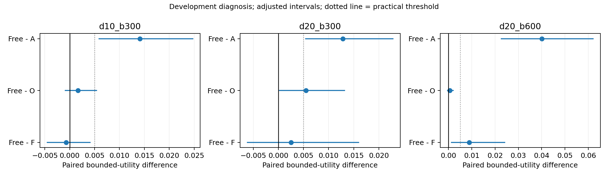
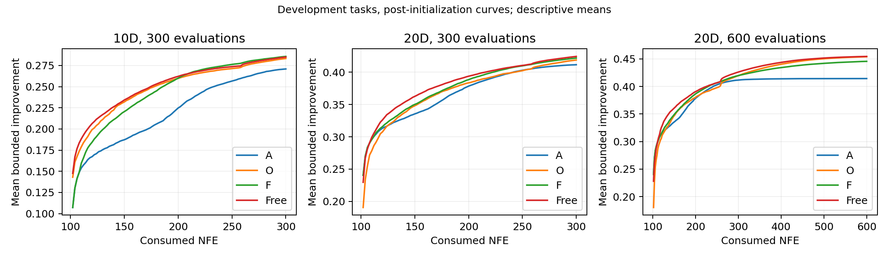

# 自由分配槽位：完成结果与停止决定

本轮完成2592条新增轨迹、1036800次目标调用，复用此前6048条A/O/F轨迹作为配对参照。所有648个新增批次和复用数据均通过身份/内容哈希、实际预算核验。教师调用为0，工作进程全部结束。

本轮假设来自已经查看的四组结果，因此全部比较属于开发诊断，不称为独立确认。各条件只作三项预定比较，区间为Bonferroni98.3333%边际区间，条件内名义家族覆盖95%；三个条件之间未再校正。

## 结果

| 条件 | Free−A | Free−O | Free−原F |
|---|---|---|---|
| 10维300 | +0.01410，过门槛 | +0.00169，未过 | −0.00069，未过 |
| 20维300 | +0.01281，过门槛 | +0.00552，过门槛 | +0.00253，未过 |
| 20维600 | +0.04011，过门槛 | +0.00058，未过 | +0.00886，过门槛 |

“过门槛”同时要求平均有界改善差≥0.005、校正区间下界>0及三个训练种子平均效应均为正。不是简单看均值正负。全部区间及种子效应见development/COMPARISONS.json。

曲线是描述性均值，未作逐评估时刻的显著性检验。

预定主目标20维600预算：Free−F为0.008864，区间[0.001331,0.024096]；Free−O为0.000584，区间[−0.000459,0.002039]。这支持解除固定槽位与门控的整体分配限制改善原F，但尚未建立该条件下离线提案相对在线控制的独立实用收益。不能把前者单独归因于保留第一anchor槽位，因为门控也同时移除了。

20维300预算下Free−O的正向结果值得保留，但不能据此在结果之后把主目标从600改成300，或把开发结果称为独立确认。原四组中的F+R结果保留：延长anchor训练且匹配重训residual之后，residual独立收益仍未成立。

## 决策行为

Free每条轨迹平均真实评估anchor提案16.25、26.27、32.73次，分别占初始化后200、200、500次预算的8.13%、13.13%、6.55%。因此它并非从不使用离线提案，但大多数后续槽位给了共同portfolio。原F至少保留一半初始化后槽位给anchor，此外还可能回退；两者的预算安排明显不同。

上述比例是使用频率，不是离线提案对最终增益的因果百分比。没有为未付费候选调用反事实真值。

## 停止与研究方向

预定20维600预算下相对A、O、F的三项联合门槛未通过，故没有触发新实例确认；没有额外训练、调阈值、扩大网络或重训residual。这是已执行的停止规则，不是遗留未完成任务。

现有证据已将两个问题分开：80轮确实限制了当前配方的验证表现；解除强制评估分配也能改善特定条件，但二者尚不能恢复“完整方法稳定超过离线与在线两端”的论文主张。并未证明所有离线学习无效，也未证明网络宽度最优。

如果继续研究，新的核心假设应围绕离线提案能否提供当前在线portfolio缺少的、有可验证增益的搜索方向，并用匹配O作直接对照。那需要另行固定训练目标和验收，而不是从本轮结果自动衍生一串局部变体。当前论文应保留条件性正向证据、阴性组件结果及来源限制。
