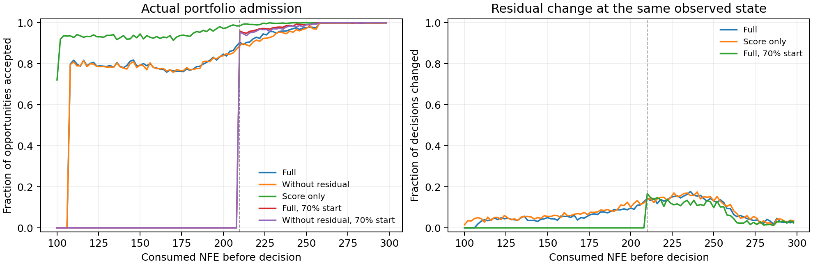

# 统一候选的实际算法与验收边界

本文件描述新候选，不替换原解锁最终版。阶段三已完成：总体融合和较早干预通过开发验收，residual独立价值和保护机制验收未通过。阶段四按预登记规则检验简化的no_residual；不以外部结果重选模型。公式、常数和统计规则以[预登记协议](../../experiments/UNIFIED_REVISION_PROTOCOL.md)为准。

## 离线链路

事前固定的12种系数组合×3尺度，共36个程序化配置全部保留，不使用测试ELA或测试成绩筛选。生成规则、训练/验证/开发角色及随机流各自记录。它们属于同一生成分布，换实例不能称未见函数族。

三个训练种子各自从头训练anchor，保持原架构，使用既有共享尺度质量目标；同一种子下所有消融共享同一anchor。验证按完整300NFE搜索质量选模，包含第0轮参照。

冻结对应anchor后，用统一no-residual行为策略采集训练/验证日志。每轮记录两个anchor和36个候选的实际输入特征，全池教师真值只产生离线标签；不进入行为策略的档案、误差证据、成功记忆或候选选择。训练residual的原结构MLP，标签为改善当前历史最优。其输出作为评分信号，不解释为击败anchor的校准概率。

## 在线链路

1. 付费评估100个初始点，建立种群与档案。每条轨迹总预算300，含初始化。
2. 计算当前状态。固定初始化的辅助网络和六算子产生36候选；冻结anchor另产生两个候选。
3. 当前档案拟合在线ridge集成，一次预测全部38点。计算统一的无量纲基础评分，按配置加入residual修正；不依据任务名称改变路径。
4. 第一anchor保留真实评估槽位。第二anchor与36候选使用同一组既有分数比较；不在缩小后的候选集合中重算评分或标准化。
5. 保护规则只读取此前付费点的预测误差及当前分数优势。至少积累8个先预测后评估的点，再允许通过门控；证据不足则回退第二anchor。score-only消融取消保护；late消融另外要求已用预算达到70%。
6. 付费评估两个最终选中点，再更新预测误差、成功记忆、portfolio计数、档案和种群。日志不新增在线目标求值。循环至预算用尽。

在当前100/300预算设置中，完整候选最早可能在NFE108后替换第二槽位。是否实际采纳、是否改善早期或最终质量，必须由日志和配对结果回答，不能由“允许”推断“有效”。

阶段三预定的NFE210辅助结果已归档至EARLY_EFFECTS.json：no_residual相对anchor的有界改善差为0.027161，95%区间[0.013836,0.045031]。较早开放的最终效应另见DECISION.json。此证据限于12个生成配方族的新实例，不能据此声称未见任务普遍获益，更不能声称最初100次观测阶段由在线proxy改善。

阶段四主方法不执行residual预测；外部匹配无保护消融也移除residual，保留同一anchor、候选池与基础评分。20维采用独立训练的原生anchor，初始化仍100点；分别测试总预算300及600，不把10维权重改名为20维模型。所有方法使用同一固定边界仿射接口。完整执行设置见UNIFIED_EXTERNAL_PROTOCOL.md。

## 模块身份

| 模块 | 参数来源 | 测试时是否学习 |
|---|---|---|
| anchor | 本轮生成训练分布上的监督/可微优化训练，验证选模 | 冻结 |
| residual | 对应anchor产生的离线全池标签，验证选模 | 冻结 |
| 在线proxy | 当前任务已付费档案上的ridge解析拟合 | 每轮重新拟合 |
| 状态编码器、神经候选分支、神经prior | 固定种子初始化，与原架构一致 | 未经过离线训练，不更新权重 |
| 保护规则 | 预先固定的公式与常数 | 只更新付费观测统计量 |

## 能回答和不能回答的问题

六组开发对照分别检验融合、residual、保护及开放时机。原始目标值、有界归一化收益、风险、干预时序和成本均应保留。局部预测误差不充当最终收益的因果分解。

图中为已有完整优化过程的43.2万条决策记录的描述性比例，不把日志行当独立样本。图右是在每条实际轨迹的同一状态下移除residual修正后是否改变决定，不是两条反事实完整轨迹的逐点比较；最终贡献仍以完整消融验收。

该候选同时统一了任务路径、评分比较环境和保护规则，所得总体改进不能被单独归因于某一个修复。新的训练来源和训练配方也不能被冒充为历史训练的精确恢复。是否优于同anchor、是否有residual独立价值、是否降低退化、是否领先强基线，分别验收。
