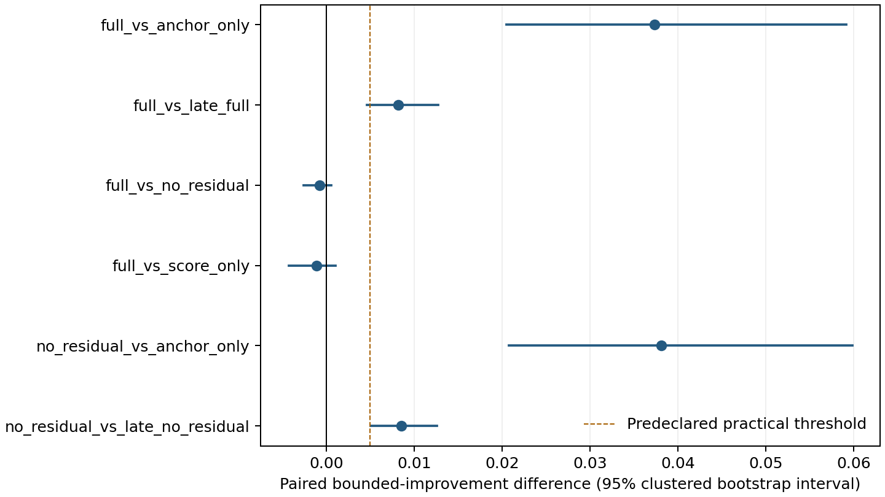
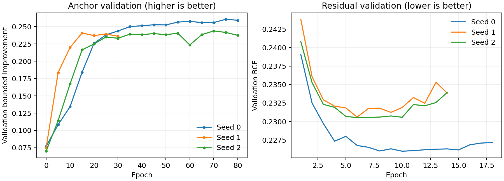

# 统一候选：受控重训与机制验收

本报告依据预登记协议；原最终版未替换。新训练源没有使用测试ELA或测试成绩筛选。
开发评测为已知12配方族、各3尺度的新实例，不称为完全未见函数族或最终独立测试。

阶段三结束时的决策：`REQUIRES_FROZEN_EXTERNAL_PROTOCOL`；后续候选：`no_residual`。该记录保留为事前选模依据。

后续阶段四现已完成，见[冻结后的外部评测](../unified_external/RESULTS.zh-CN.md)和[最终结论](../UNIFIED_CONCLUSIONS.zh-CN.md)。本页报告阶段三开发证据，不将后续外部结果写回当时的候选选择。

## 完整优化效应

| 对照 | 配对平均差 | 95%区间 | 实用改善验收 |
|---|---:|---|---|
| full_vs_anchor_only | 0.037343 | [0.020479, 0.059155] | True |
| full_vs_late_full | 0.008219 | [0.004656, 0.012737] | True |
| full_vs_no_residual | -0.000736 | [-0.002541, 0.000605] | False |
| full_vs_score_only | -0.001111 | [-0.004278, 0.001033] | False |
| no_residual_vs_anchor_only | 0.038079 | [0.020801, 0.059817] | True |
| no_residual_vs_late_no_residual | 0.008568 | [0.005056, 0.012611] | True |

效应使用预定有界归一化改善，正值表示前者较好；不是胜率或目标值百分比。
区间按12配方族、实例和3个训练种子配对重采样；只有3个训练种子，训练方差估计仍有限。

Residual独立收益验收：False。保护机制收益/风险验收：False。

## 训练记录

| 模型 | 训练结束轮次 | 验证选中轮次 |
|---|---:|---:|
| anchor_0 | 80 | 75 |
| anchor_1 | 30 | 15 |
| anchor_2 | 80 | 70 |
| residual_0 | 18 | 10 |
| residual_1 | 14 | 6 |
| residual_2 | 14 | 6 |

完整数值、成本、实际参数与原始轨迹已归档。候选构造、训练源及部分训练口径发生变化，
只能由共享同anchor的消融解释新候选内部机制；不能将新旧权重差异全归因于residual。

## 按预登记规则行动

阶段三结束时，候选通过开发验收；当时这不等于通过外部验证。随后已按冻结协议完成强基线与中等维度测试，其结果及来源重用限制另页报告；不能将“实验已完成”写成所有科学主张均通过。
