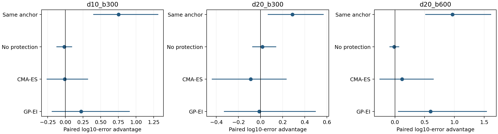
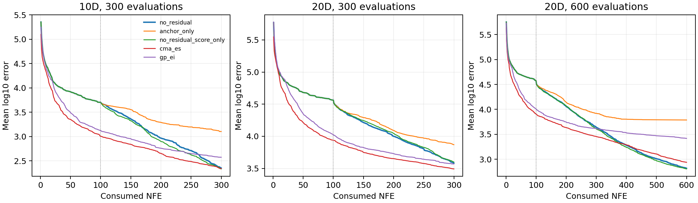
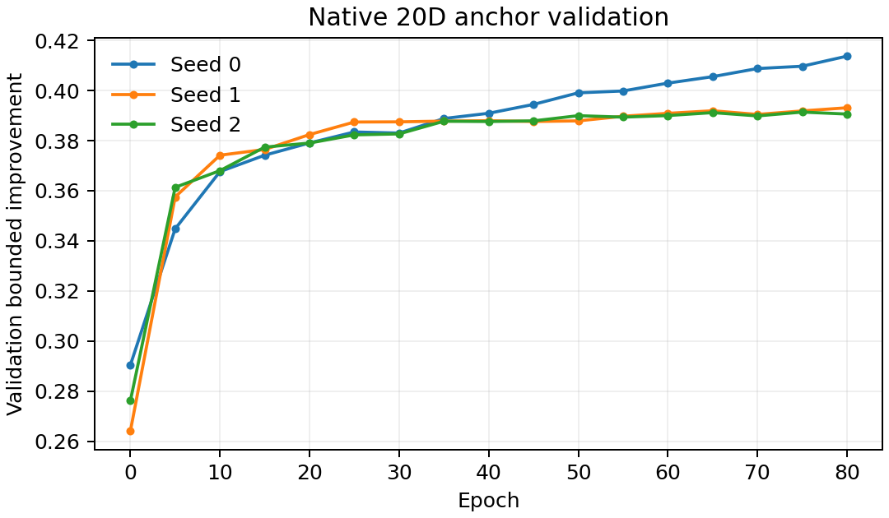

# 冻结后的 CEC2022 完整验证

本轮只检验阶段三选定的 no_residual 候选；没有用外部成绩重新选择方法。原最终版保持冻结。
采用版本与源数据哈希固定的 opfunu CEC2022 全12函数，含混合与组合函数；
10维/300NFE、20维/300NFE、20维/600NFE，每方法每函数每条件30次，共5400条轨迹。
20维anchor独立训练并由生成验证集选模，未使用测试目标或ELA筛选训练函数。
每个模型先完成验证选模与哈希冻结，再评估该模型；不同维度/种子的训练和评测有时间重叠，训练与选择规则始终固定。
作者此前对其他BBOB/CEC来源的开发接触仍须披露。本次不证明整个研究历史与所有数学原语隔离。

来源核对发现6个10维函数与既有opfunu CEC2017对象共享最优点/部分移位数据；其中F11/F12还共享旋转数组，
但组成公式/参数不同。明细见SOURCE_OVERLAP.json；这限制了完全未见函数族的解释，不能仅凭年份不同宣称完全独立。
该核对在10维结果产生后进行，不改变方法或预登记函数列表；所有结果均保留。

## 主要比较

优势=对照log10误差−候选log10误差，正值表示候选较好。区间为函数、训练/运行组、组内运行的5000次配对重采样。
三种条件分别报告；不把同一函数在不同条件下视为独立的新函数族。逐对照名义95%区间未做多重比较校正。

| 条件 | 对照 | 候选优势 | 95%区间 | 函数胜/平/负 |
|---|---|---:|---|---|
| d10_b300 | anchor_only | 0.7524 | [0.3986, 1.3093] | 12/0/0 |
| d10_b300 | no_residual_score_only | -0.0170 | [-0.1215, 0.0881] | 3/3/6 |
| d10_b300 | cma_es | -0.0094 | [-0.2608, 0.3144] | 4/1/7 |
| d10_b300 | gp_ei | 0.2227 | [-0.1872, 0.9039] | 6/0/6 |
| d20_b300 | anchor_only | 0.2880 | [0.0678, 0.5661] | 11/1/0 |
| d20_b300 | no_residual_score_only | 0.0170 | [-0.0711, 0.1377] | 3/3/6 |
| d20_b300 | cma_es | -0.0893 | [-0.4370, 0.2330] | 6/0/6 |
| d20_b300 | gp_ei | -0.0121 | [-0.3274, 0.4955] | 6/0/6 |
| d20_b600 | anchor_only | 0.9679 | [0.5158, 1.6141] | 12/0/0 |
| d20_b600 | no_residual_score_only | -0.0120 | [-0.0839, 0.0661] | 3/3/6 |
| d20_b600 | cma_es | 0.1205 | [-0.2524, 0.6458] | 6/0/6 |
| d20_b600 | gp_ei | 0.5996 | [0.0602, 1.5402] | 8/0/4 |

函数胜/平/负按30运行的平均log误差差计算，绝对差≤0.01为平；不代替统计检验。
训练种子只有3个，外部每组分配不同运行；训练随机性与运行组变异未完全分离。
置信区间限于本套件的重采样，不是普遍可靠性或非退化保证。

收敛曲线是每方法360条真实轨迹的平均log误差，含初始化，属于描述性辅助图；没有额外目标查询或逐点显著性宣称。

## 保护风险

风险为初始标准差归一化的有界改善相对同一anchor降低超过0.02的运行比例。
两种融合配置共享相同初始100点；无保护对照也去掉residual，能够单独比较保护规则。

| 条件 | 候选退化比例 | 无保护退化比例 | 风险降低及95%区间 |
|---|---:|---:|---|
| d10_b300 | 0.0083 | 0.0056 | -0.0028 [-0.0278, 0.0139] |
| d20_b300 | 0.0056 | 0.0083 | 0.0028 [-0.0083, 0.0194] |
| d20_b600 | 0.0000 | 0.0028 | 0.0028 [0.0000, 0.0167] |

## 20维训练与计算成本

| 种子 | 训练结束epoch | 验证选中epoch |
|---|---:|---:|
| 0 | 80 | 80 |
| 1 | 80 | 80 |
| 2 | 80 | 75 |

线上计时见serial_timing.csv，固定F1/F8、10维300与20维600，每方法各4次按序计时。
这些重复额外消耗9000次目标评估，不加入主性能样本数；宿主机器并非独占。
串行计时包含模型构造/载入和在线搜索，不含Python启动、opfunu实例载入、缓存核验及结果写盘。
objective_seconds只包目标evaluate计算；边界映射、张量转换等计入overhead_seconds。
并行原始seconds包含资源竞争，少数任务还保留了暂停等待时间，不能用其做串行速度排名。
主评测216万次目标调用、所有离线训练/标签及验证费用分列在COSTS.json。
初始化计入预算；原生GP使用20点LHS、CMA使用10点种群，学习方法保留100点初始化。
所有方法使用固定边界仿射接口；优化器不访问已知最优值。神经状态为float32，
目标计算和最终统计为float64。此精度差异作为实现限制披露。

## 论文边界

本外部表检验简化候选，不为residual增益背书。阶段三残差独立收益未成立。
存在anchor回退不等于保护已有效；必须结合上面的匹配对照与风险区间逐条件解释。
20维是中等维度证据，不是高维、噪声或约束优化证据；不新增这些未经测试的主张。
若强基线占优，保留结果并收紧论文定位，不以本表启动另一轮局部调参。
